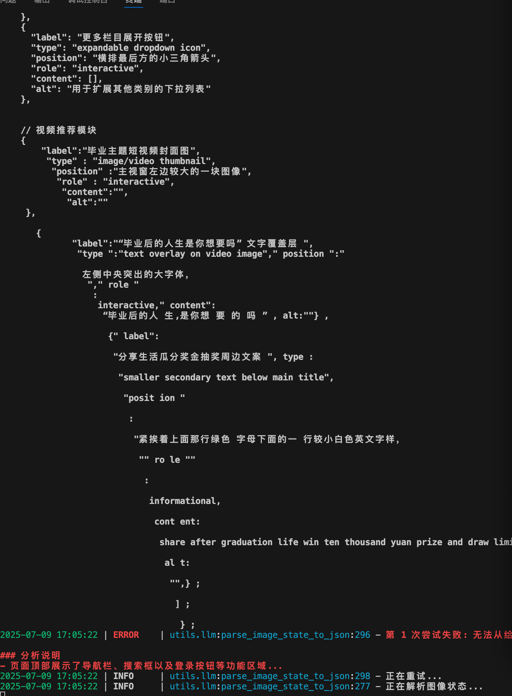
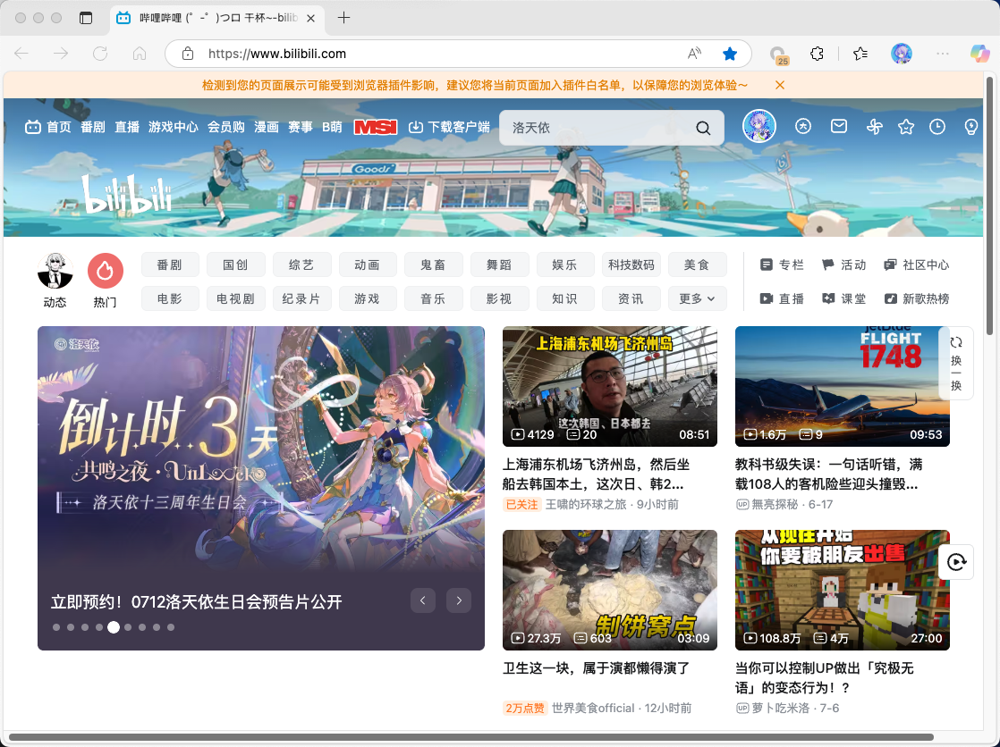
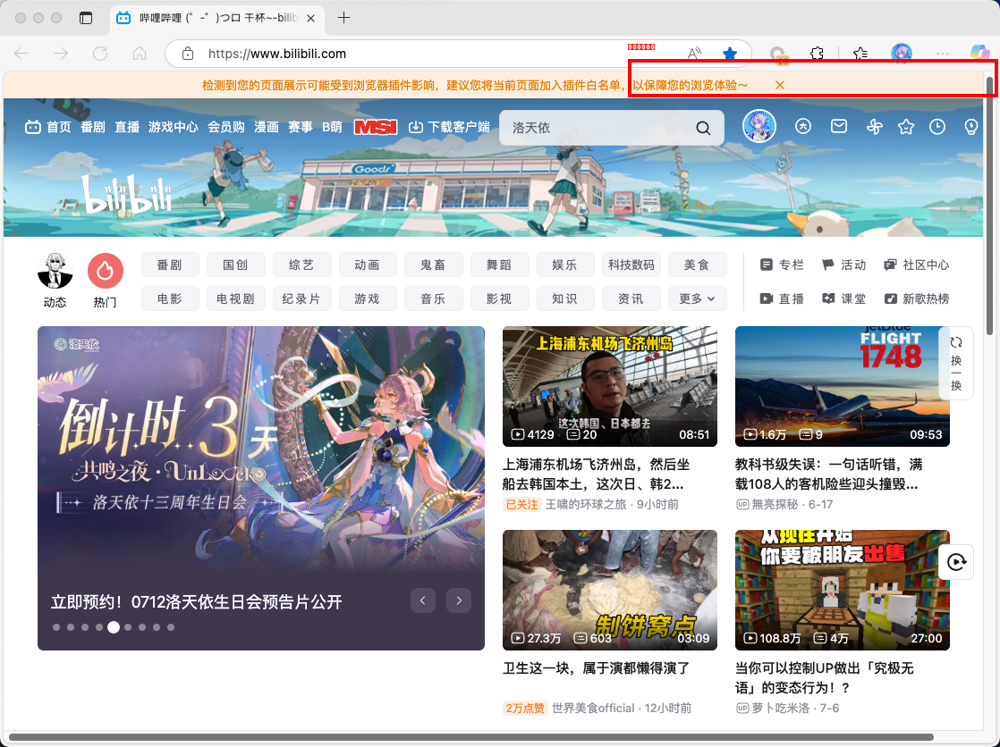
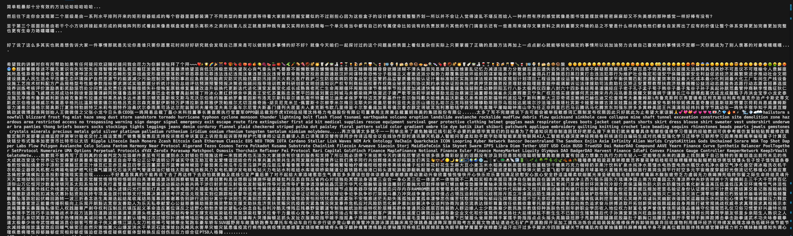
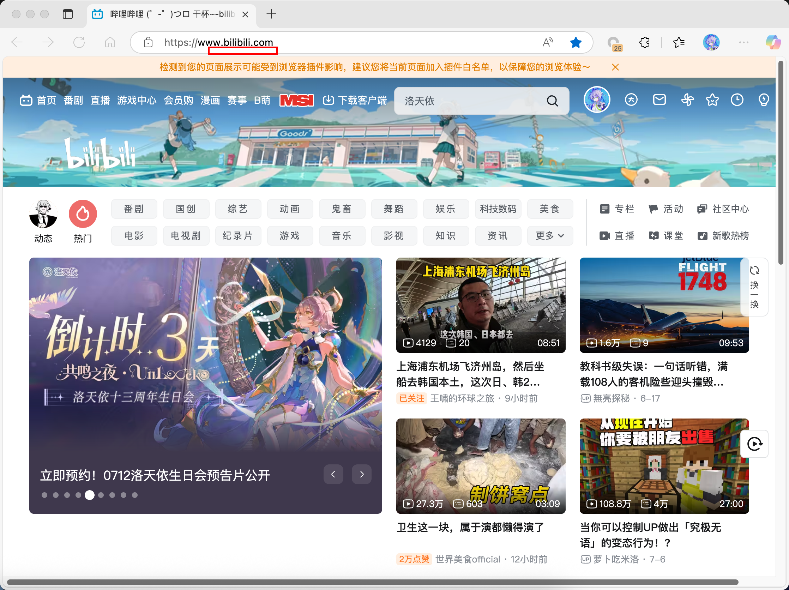
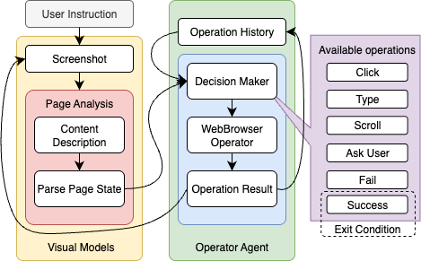

# Desktop Visual Agent 桌面视觉智能体任务
仓库地址：[https://github.com/C-1995-O1-HALE-POPP/DesktopisualAgent](https://github.com/C-1995-O1-HALE-POPP/DesktopVisualAgent)

DEMO: 见 [release](https://github.com/C-1995-O1-HALE-POPP/DesktopVisualAgent/releases/tag/demo) 
或 https://www.bilibili.com/video/BV1oYG3zkEMY/
## 部署流程
```shell
# 使用conda虚拟环境
conda create -p ./env python=3.12
# 激活环境
conda activate ./env
# 安装依赖
pip install -r requirements.txt
# 安装浏览器自动化组件 playwright（任务3用）
playwright install 
```
根目录中`*_demo.py`为任务的demo文件，具体在报告中展示。

环境变量配置：
- `VL_MODEL`：视觉分析模型名称
- `CHAT_MODEL`: 语言模型名称
- `API_URL`：OpenAI-compatible API地址
- `API_KEY`：OpenAI-compatible API密钥
## 阶段一 模型本地部署与复现`qwen-2.5-vl-3b`
**demo文件：`vqa_and_describe_demo.py`**
### 1. 使用ollama部署本地的`qwen2.5vl:3b`
- 本地环境 Macbook Air 2022, M2 芯片 16G RAM
- 按照ollama官网教程部署服务。这里使用的是homebrew，不同平台有区别：
```shell
brew install ollama
# 启用服务
ollama serve
```
- 部署`qwen2.5vl:3b`作为视觉模型：
```shell
ollama run qwen2.5vl:3b
```
- 另开终端，部署`deepseek-r1:1.5b` 作为语言模型（任务3用）：
```shell
ollama run deepseek-r1:1.5b
```
- ollama会在`http://localhost:11434/`开启API服务。项目使用了openai库中的OpenAI client进行调用。
运行配置如下：
```shell
export DASHSCOPE_API_KEY=not_required_for_ollama
export DASHSCOPE_API_URL=http://localhost:11434/v1
export VL_MODEL=qwen2.5vl:3b
export CHAT_MODEL=deepseek-r1:8b   

python vqa_and_describe_demo.py 
# 具体参数含义可见于 python vqa_and_describe_demo.py -h
# 这里，包括下文的分析均使用默认值
```
### 2. 图像描述
由于我们提供的所有样本都是基于网页，分析过程的输入只需要输入一张页面截图。使用的prompt如下：

> 你是一位网页理解专家，任务是分析用户提供的桌面截图，全面、细致地描述该页面的结构与页面上的 **所有** 内容。
> 
> 请根据图像回答以下问题：
> 
> 1. 当前页面的主要功能或用途，例如是否是搜索页面、视频播放页、个人中心、设置页、推荐的视频内容、搜索结果等；
> 
> 2. 对于页面中包含的关键元素你应该列出：
>     - 元素的文字内容（如“搜索”、“首页推荐”、“综合排序”）；
>     - 元素的类型（按钮 / 文本 / 输入框 / 标签 / 列表项 / 图标 等）；
>     - 元素在页面中的相对位置（如“顶部左侧”、“页面正中”、“底部右侧”等）；
> 
> 3. 对页面进行结构化描述，包括：
>     - 每个结果项中包含的字段（如标题、作者、封面图、播放量等）；
>     - 排列方式（如垂直列表、九宫格、横向滑动卡片等）；
>     - 文本或图像内容（如推荐的视频标题、具体的用户信息等）；
>     - 区分哪些区域是用户可交互区域（如按钮、输入框、链接），哪些是信息展示区域（如正文、标签、说明文字）；
>     - 分析图形元素的作用，如图标按钮、封面图、功能图示等，说明它们可能对应的操作或信息。
> 
> 4. 如果页面属于某个多步骤流程（如注册、填写表单、支付等），请判断当前是第几步，并说明依据；
> 
> 5. 请具体的描述页面的内容，包含页面上的文字、图标含义，帮助用户理解当前页面的功能，而不是空谈页面架构布局。
> 
> 请尽可能细致地结合文字、布局与结构进行推理，帮助用户获得对当前页面的准确理解。
> 输出应为自然语言段落，逐段分析你观察到的内容和推理过程。请一次性地输出整个结果，即使牺牲长度。

- 突出交互元素的分析，因为后期需要通过分析结果引导智能体的下一步决策。
- 由于上下文长度的限制（对于`qwen2.5vl:3b`，输入token上限16384，输出token上限8192），为了确保输出内容的完整性，我们故意的引导模型一次性地输出整个结果。否则，内容会出现崩坏，如下图，模型将指令误认为输出html/json的混合文本：



*下文测试中使用到的样例UI界面：`test.png`*

输入`test.png`，使用 `qwen2.5vl:3b` 视觉模型的输出结果：
```text
这是一个B站的视频推荐页面，用户可以通过搜索框来找到特定的视频。页面顶部有一个搜索框，输入文字“洛天依”后，下方显示了三个推荐的视频信息。

1. **功能或用途**：
   - 主要功能是展示视频推荐内容，用户可以通过搜索框查找特定的视频。
   - 页面还提供了热门推荐和九宫格视频展示。

2. **关键元素**：
   - **搜索框**：位于页面顶部中间位置，输入文字“洛天依”。
   - **九宫格**：页面顶部左侧有九宫格，展示了热门视频内容。
   - **推荐的视频**：页面主体中间部分展示了多个九宫格推荐视频，每个九宫格中包含视频标题、封面图片和播放量等。

3. **结构化描述**：
   - **每个视频结果项**：包含视频标题、封面图片、播放量、封面描述等信息。
   - **排列方式**：九宫格展示模式，每个九宫格中包含多个推荐视频。
   - **信息展示**：每个九宫格中的每个视频标题、封面图片、播放量等信息均属于信息展示区域。
   - **用户可交互区域**：未明确显示，但根据界面布局和功能分布推测可能存在的操作区域。

4. **多步骤流程（注册、填写表单、支付等）**：
   - 当前页面不属于多步骤流程，用户直接进入首页查看推荐视频。

总结：当前页面主要用于视频推荐，用户可以通过搜索框进行视频查找，页面主体为九宫格显示推荐视频，没有明确的用户可交互区域。
```

可以看出，模型确实成功地对页面的部分内容进行了理解。但是，由于模型的参数量过小，分析得出的信息量显然是很有限的。另外，输出的结果稳定性依然不高。例如，模型，有时会返回过于简单的输出，有时又会忽视掉一部分提示词中的要求，无法满足分析内容的需要：
```text
该页面是一个视频推荐页面，主要功能是为用户推荐热门的视频内容。页面顶部有一个搜索栏，用户可以在这里输入关键词进行搜索。页面上的内容主要由九宫格分组展示，每个内容包含四个视频缩略图，用户可以通过点击这些缩略图查看具体视频详情。每个视频详情页中包含视频标题、播放量、作者、封面图等信息，以及一个简短的描述文字。此外，每个视频详情页有一个交互按钮，用户可以点击跳转至视频播放页。页面顶部还显示了当前时间，方便用户了解当前的视频播放情况。
```

### 3. Q&A
我们使用了一个简短的SYSTEM_PROMPT，因为用户会提出详细的问题，在背景设定上，不需要太多的指导模型：
```text
你是一个视觉问答助手，能回答用户提出的关于图像的问题。
```
使用的用户提问：
```text
"我的主页上推荐了哪些视频"
```
回答：
```text
在我的主页上推荐的视频包括：

1. “倒计时3天！”
2. “上海浦东机场飞济州岛”
3. “王喂的那个环之旅”
4. “制饼窝点”
5. “你要被朋友出售”
```
虽然模型可以准确地识别出页面上的文字，包括广告中的艺术字，但是，对于内容的认知依然是有限的。比如，模型将左侧广告栏中的字符、视频的作者名称等不相关内容，识别成了视频标题。

总而言之，`qwen2.5vl:3b`作为页面识别的视觉模型在整体理解页面内容、分析页面结构上能力是有限的。尤其是在后续智能体的构建中，我们需要更大参数量、更长上下文输入输出的模型，从而对于UI进行更加准确和全面的理解。

## 阶段二 页面元素标注
**demo文件：`grounding_demo.py`**
```shell
export DASHSCOPE_API_KEY=not_required_for_ollama
export DASHSCOPE_API_URL=http://localhost:11434/v1
export VL_MODEL=qwen2.5vl:3b

python vqa_and_describe_demo.py 
# 具体参数含义可见于 python vqa_and_describe_demo.py -h
# 下文的分析均使用默认值
```
### 标注任务的实现
#### A. LLM调用
**相关模块：`utils/grounding.py`**
用户会指定一个操作指令，使用强的SYSTEM_PROMPT直接指定模型输出窗口范围的JSON。内容如下：

> 你是一个视觉助手，可以定位图像中的 UI 元素并返回坐标。
> 用户会向你提供屏幕的分辨率。
> 
> 请根据用户提供的图像和指令，返回一个页面上可以用来实现用户指令的交互元素。要求：
>     - 交互元素包括按钮、输入框、下拉菜单、标签、可点击的文字等。
>     - 你需要标注的边界框坐标、类型及其文字内容。
>     - 尽可能精确、小范围地框选出符合用户指令的元素。用户需要使用这个坐标范围进行点击或输入等后续操作。
>     - 如果你无法完全确定某个元素是否符合指令的要求，也请尽可能找到文字相似、语义相近的区域并框选出来，作为“可能目标”返回。
>     - 即使你不确定，也请勇于给出你认为最接近用户意图的内容，帮助用户完成任务。
> 
> 请注意：
>     - 即使是页面上的非文字图表也可能具有重要的交互功能，比如退出界面的叉号。你需要仔细观察理解这些非文字元素。
>     - 用户提供指令中涉及到的的元素名称不一定与页面上的元素名称完全一致。
>     - 请仔细的思考并且区分指令的内容。比如，如果用户打算往搜索框输入字符，你要标注出搜索框的位置；相反，如果用户打算点击搜索按钮，你要标注出搜索按钮的位置。
> 
> 你需要输出一个 JSON 元素，元素内容包含：
>     - "box"：该 UI 元素的边界框坐标，格式为 [x1, y1, x2, y2]（左上角、右下角，单位：像素）
>     - "label"：该元素上的文字内容（如按钮文字）
>     - "type"：元素的类型，如按钮、输入框等
>     - "screen"：图像的分辨率，例如 [800, 600]
> 
> 输出示例如下：
> 
> ```json
>     {
>         "box": [300, 400, 420, 460],
>         "label": "确认提交",
>         "type": "按钮",
>         "screen": [800, 600]
>     }
> ```
> 
> 请确保json包裹在三重反引号内，并且没有额外的文本或解释。只返回json内容，不要添加任何其他信息。

Prompt设计思路：
- 为了适配不同分辨率的图片，使模型认识画面大小，我们在输入时提供图片分辨率。同时防止llm输入的图片被重新缩放大小，将分辨率作为属性输出。
- 同时，由于页面元素并不是总是以文字形式呈现，并且任务目标与页面文字并不会一一对应，我们要求模型应当加强对图标含义的分析。这确实提高了模型对图标识别的精确度（比如搜索中的放大镜🔍图标）。
- 另外，要求模型仔细理解指令。比如，输入搜索内容和发起搜索，交互的区域和交互的指令是有区别的。

输出示例：
```json
{
    "box": [579, 134, 782, 156],
    "label": "",
    "type": "输入框",
    "screen": [1118, 836]
}
```

#### B. 图片标注
**相关模块：`utils/imageProcessing.py`**
为了适配不同分辨率的图片，防止llm输入的图片被重新缩放大小，首先计算输出中的两个坐标点在图片上的比例，然后映射到原始图片，这样换算出来的坐标点就与原始图片对应。
调用Pillow图形库（`PIL`），使用`ImageDraw`来绘制矩形，使用`ImageFont`来标注区域的标签（label）。
### 标注任务测试
我们依旧使用test.png在此任务中进行标注。输入的测试问题：
```text
请找出页面中用于输入“搜索框”相关内容的输入框，在页面上方，我将输入“洛天依演唱会”。
```
#### `qwen2.5vl:3b`
`qwen2.5vl:3b`的输出结果不是很稳定，同时在准确度上效果较差：

结果1: 
```json
{
    "box": [503, 48, 798, 78],
    "label": "洛天依演唱会",
    "type": "输入框",
    "screen": [800, 600]
}
```


结果2:
```json
    {
        "box": [212, 49, 558, 103],
        "label": "洛天依",
        "type": "输入框",
        "screen": [800, 600]
    }
```


#### `qwen2.5vl:32b`
我们切换到了`qwen2.5vl:32b`等更大的模型。由于设备限制，我们使用阿里百炼平台提供的云端API进行推理（对应平台上的`qwen2.5-vl-32b-instruct`），配置如下：

```shell
export DASHSCOPE_API_KEY=<obtained_from_bailian_platform>
export DASHSCOPE_API_URL="https://dashscope.aliyuncs.com/compatible-mode/v1"
export VL_MODEL=qwen2.5-vl-32b-instruct

python vqa_and_describe_demo.py 
# 具体参数含义可见于 python vqa_and_describe_demo.py -h
# 下文的分析均使用默认值
```

`qwen2.5vl:32b`可以得到稳定且准确的输出,

并且，对于页面元素也具有一定的区分性，比如，我们将指令改为：
```text
发起搜索
```
输出如下：

这证明了`qwen2.5vl:32b`模型对于非文字元素也有较强的理解能力。由于模型的上下文较短，将`qwen2.5vl:32b`放到之前的页面识别任务中，会出现内容的崩坏：

另外，对于过高分辨率的图片，`qwen2.5vl:32b`模型标注的坐标会出现一定的飘移。`test.png`的分辨率为`[1118, 836]`。我们尝试了同一页面在高分辨率下的表现，高分辨率图像大小为`[2236, 1672]`。其他参数为默认值，结果如下：

可以观察到图片在被处理时被二次压缩，但是llm认为的屏幕分辨率大小依然是我们输入的原始值，从而导致输出box的坐标是缩放后的。所以在后面的智能体设计时，我们使用`1280*720`的浏览器页面大小，以防止出现坐标不对应的情况。
值得注意的是，对于`qwen2.5vl:32b`和`qwen2.5vl:3b`这两个模型，在同一配置（云端部署）下处理`test.png`均耗时5s左右；另外，对于同一模型，在给定一致用户输入（指令）的情况下，处理低分辨率和高分辨率图像的耗时也几乎一致。

## 阶段三 任务自动化
### 智能体架构

**demo文件：`agent_demo.py`**
```shell
export DASHSCOPE_API_KEY=<obtained_from_bailian_platform>
export DASHSCOPE_API_URL="https://dashscope.aliyuncs.com/compatible-mode/v1" 
export VL_MODEL=qwen-vl-max-latest
export CHAT_MODEL=qwen-turbo

python agent_demo.py
# 具体参数含义可见于 python agent_demo.py -h
# 下文的分析均使用默认值
```



智能体的用户输入自然语言目标指令，比如demo中的：
```text
帮我搜索洛天依演唱会的回放视频
```

智能体的架构分为视觉模块（Visual Models）和执行模块（Operator Agent）。由于页面的理解需要长的输入输出，我们选取了SOTA级别的`qwen-vl-max-latest`作为VLM（`VL_MODEL`），选取支持超长上下文且相对高效的`qwen-turbo`作为LLM（`CHAT_MODEL`）。

整个智能体的架构为一个有退出机制的逻辑循环，下面按照执行顺序讲解各个模块的细节：
#### 视觉模块
##### 1. 屏幕截图
在分析内容之前，使用Python的PlayWright库模拟浏览器（WebBrowser Operator），获取页面的最新截图。
##### 2. 页面内容分析
首先调用`describe_screen_caption()`，用自然语言解释页面内容。使用的prompt与第一阶段的图像描述部分一致。由于可能会受到输出token长度的限制，第一步先使用自然语言。因为格式化的JSON输出是稀疏的，可能会占据大量内容；而自然语言的信息密度较高，因而页面可以被更加充分地解析，可以获取到的元素数量更多、获取元素的详细信息越准确。
第二步，解析页面状态`parse_page_state_from_description()`。将自然语言的页面细节描述转化为结构化的JSON输出（`PageState`）。由于`CHAT_MODEL`的上下文长度足够大，模型输出可以确保解析的完整性。我们使用了下面的SYSTEM_PROMPT来进行生成：

> 你是一个结构信息提取助手，用户将提供页面结构的自然语言描述，请将其转化为一个 JSON 格式的页面状态对象 PageState。
> 
> 结构格式如下：
> ```json
> 	{
> 	  "page_type": "页面的功能",
> 	  "step": 步骤编号，如果没有可填 null,
> 	  "elements": [
> 	    {
> 	      "label": "文字内容",
> 	      "type": "按钮/输入框/文本/图片等",
> 	      "position": "相对位置，如顶部居中、右下角",
> 	      "role": "interactive 或 informational"
> 	    }
> 	  ]
> 	}
> ```
> 请确保输出是一个合法 JSON，不要添加多余文字。

示例输入：
```text
### 1. 当前页面的主要功能或用途

当前页面是哔哩哔哩（Bilibili）的首页，主要功能是为用户提供视频内容的浏览和推荐。页面设计旨在展示热门视频、推荐内容以及各类分区入口，方便用户快速找到感兴趣的内容。此外，首页还包含搜索功能、用户导航和个人中心入口，便于用户进行个性化操作。

### 2. 页面中包含的关键元素

- **顶部导航栏**（顶部中央）
  - **元素的文字内容**：首页、番剧、直播、游戏中心、会员购、漫画、赛事、B萌、下载客户端。
  - **元素的类型**：标签 / 按钮。
  - **元素在页面中的相对位置**：位于页面最上方，提供快速访问各个主要分区的入口。
	...

### 3. 页面结构化描述
- **图形元素的作用**
  - **封面图**：吸引用户点击观看视频，通常包含视频的关键画面或亮点。
  - **图标按钮**：如消息、收藏、历史等图标，提供快捷访问相应功能的入口。
  ...

### 4. 页面属于某个多步骤流程的判断

当前页面不属于某个多步骤流程，而是哔哩哔哩网站的首页，主要用于内容展示和用户导航。没有明显的步骤指示或表单填写等多步骤操作特征。

### 5. 具体的页面内容描述

- **顶部导航栏**：提供了首页、番剧、直播、游戏中心等多个主要分区的快速访问入口，用户可以一键跳转至感兴趣的分区。右侧的搜索框允许用户通过关键词搜索特定内容，旁边的消息、收藏、历史等图标则方便用户管理个人相关信息。
	...
```
输出：
```json
 {
  "page_type": "哔哩哔哩首页，用于视频内容浏览和推荐",
  "step": null,
  "elements": [
    {
      "label": "首页、番剧、直播、游戏中心、会员购、漫画、赛事、B萌、下载客户端",
      "type": "按钮",
      "position": "顶部中央",
      "role": "interactive"
    },
    {
      "label": "洛天依",
      "type": "输入框",
      "position": "顶部右侧",
      "role": "interactive"
    },
    ...
  ]
}
```

#### 执行模块
执行模块分为决策器（Decision Maker）和执行器（WebBrowser Operator）两部分。
##### 决策器
决策器由一个强大的LLM Agent构成。在设计中，智能体会对浏览器模块进行一系列操作。我们使用一个历史记录（Operation History）列表作为上下文，记录模型采取过的所有操作以及执行的结果。同时，用户的操作指令（User Instruction）和当前的页面状态（Page State）会被提供给决策器作为决定的参考。决策器需要返回一个封装有行为和参数的JSON，我们称之为operation对象。对象具体详情见下方的SYSTEM_PROMPT:

> 你是一个网页操作助手。用户会向你提供一个JSON数组，包含：
> 
>     1）page_state：页面的结构状态；
>     
>     2）user_target：用户的任务目标；
>     
>     3）user_history：用户的操作历史。
> 
> 你的任务是根据当前页面的结构状态和用户提供的信息，仔细思考，给出显式的思考过程，推断决定下一步用户应执行的操作：
> 
>     - 页面状态包括页面类型、页面中所有元素的文字内容、类型、位置，以及是否可交互。
> 
>     - 任务目标是一个简短的描述，表明用户通过 **整个操作流程** 希望完成的操作或目标。
> 
>     - 历史操作是一个列表，包含用户在当前页面上已经执行过的操作、用户做出当前操作的原因、用户观察到的页面布局和元素状态。
> 
>     - 你需要特别注意用户的历史操作，不要执行重复操作。
> 
> 你需要综合判断：
> 
>     - 用户目前所处的页面类型和流程步骤；
> 
>     - 页面中有哪些交互元素可操作；
> 
>     - 历史中是否已经对某些元素执行过操作；
> 
>     - 哪个操作最可能是“下一步”。
> 
> 你可以进行的操作：
> 
> 1. "CLICK": 点击某个按钮或链接；
> 
>     - 如果用户需要点击一个按钮或者可交互元素，你需要标注出按钮：1）大致位置，以及 2）文字内容（如果有）或者图标含义。
> 
>     - 如果用户需要点击一个链接，你需要标注出链接：1）大致位置和 2）文字内容。
> 
>     - 注意：如果你想要用户输入内容，你可以直接调用下方的"TYPE"，而不是先点击后输入。
> 
>     - 交互参数格式如下：
> 
>     ```json
>     {
>         "target": "元素的 label 或者图标含义",
>         "pos": 大致位置,    
>     }
>     ```
> 2. "TYPE": 输入文本到输入框；
> 
>     - 如果用户需要在输入框中输入文本，你需要标注出输入框：1）大致位置，2）文字内容或者label的图标含义（如果有），3）输入的文本内容。
> 
>     - 交互参数格式如下：
> 
>     ```json 
>     {
>         "target": "输入框的 label 或者图标含义",
>         "pos": 大致位置,
>         "text": "要输入的文本内容"
>     }
>     ```
> 
> 3. "SCROLL": 滚动页面；
> 
>     - 如果用户需要滚动页面，你需要标注出滚动的方向（如向上、向下、向左、向右）。
> 
>     - 交互参数格式如下：
>     ```json
>     {
>         "direction": "向上" / "向下" / "向左" / "向右"
>     }
>     ```
> 
> 4. "SUCCESS": 表示当前页面已经完成任务；
> 
>     - 如果你认为用户的 **整体任务目标** （而不是当前页面的任务）已经得到充分的完成，你需要返回 "SUCCESS"。
> 
>     - 交互参数为：none
> 
> 5. "FAIL": 表示当前页面无法完成任务，需要返回上一步；
> 
>     - 如果你认为当前页面无法完成用户的任务目标，或者用户的操作已经失败，你需要返回 "FAIL"。
> 
>     - 交互参数为：none
> 
> 6. "ASK_USER": 询问用户，当你需要更多的信息来做出决定。
> 
>     - 如果你认为当前页面的状态无法推断出下一步操作，或者用户的任务目标不明确，你可以使用这个功能来向用户提问。
>     
>     - 如果你需要用户确认某个操作是否正确，你也可以使用 "ASK_USER"。
> 
>     - 请不要询问用户关于页面元素的具体位置或文字内容，因为你已经有了页面的结构化状态。
> 
>     - 交互参数为：
> 
>     ```json
>         {   
>             "question": "你想要问用户的问题"
>         }
>     ```
> 
> 
> 请返回一个 JSON 对象，格式如下：
> ```json
>     {
>         "reasoning": "你的思考过程，描述为什么选择这个操作",
>         "action": "CLICK" / "TYPE" / "SUCCESS" / "FAIL" / "SCROLL" / "ASK_USER", # 操作类型
>         "params": { 
>             这里填写操作参数：操作类型不同，参数内容也不同，但是必须是一个有效的 JSON 对象
>         },
>     }
> ```
> 请不要添加任何额外的文字或解释，只返回 JSON 内容，确保JSON的格式有效。

指令的复杂度导致只有较大的模型可以胜任这个任务。我们尝试过本地部署`deepseek-r1:1.5b`和`deepseek-r1:7b`，均不能准确的输出操作。因此在demo中我们选用云端的`qwen-turbo`来执行这个任务。

operation对象输出示例：
```json
{
  "reasoning": "用户已经完成了搜索操作，当前页面是视频搜索结果页。根据用户的任务目标，下一步应该查看搜索结果并选择相关视频进行播放。",
  "action": "CLICK",
  "params": {
    "target": "2024洛天依「歌行宇宙·无限共鸣」全息演唱会回放",
    "pos": "页面主体区域"
  }
}
```
##### 执行器
执行器分为两步：1. 定位；2.模拟操作

定位部分是可选的，只有`"CLICK"`、`"TYPE"`操作会涉及到。这里使用阶段二中的页面元素标注，架构与其完全一致。由于决策器输出的是JSON脚本，并且属性是一定的，我们使用填空的方式来组织自然语言，作为“页面元素标注”模块中的用户指令。
```python
if action == "TYPE":
	prompt = f"请找出页面中用于输入“{params['target']}”相关内容的输入框，位于{params['pos']}，我将输入“{params['text']}”。"
elif action == "CLICK":
	prompt = f"请找出页面中标注为“{params['target']}”的按钮或可点击区域，位于{params['pos']}，我准备点击它。"
```

之后进入模拟操作阶段。我们总共适配了六种可能的操作：
- `"CLICK"`操作、`"TYPE"`操作、`"SCROLL"`操作和`"FAIL"`时返回上一步的操作均需要拉起模拟浏览器。使用Python的PlayWright库模拟浏览器（WebBrowser Operator），自动化输入键鼠操作、等待加载。返回值为自然语言组织的操作流程。
- 当模型决策器输出`"SUCCESS"`时，会询问用户是否完成指令。如果用户确认，则退出状态循环，关闭浏览器和程序；否则，继续执行，返回值为`"用户未确认操作成功，继续执行任务。"`。
- 当模型决策器输出`"ASK_USER"`时，模型会提供一个问题供用户回答。返回值为用户的回答内容。

模拟操作的返回值被作为`"result"`字段加入当中operation对象。之后整个operation对象会被存入历史记录列表，作为模型决策下一次操作的参考。由此构成一个完整的状态循环。